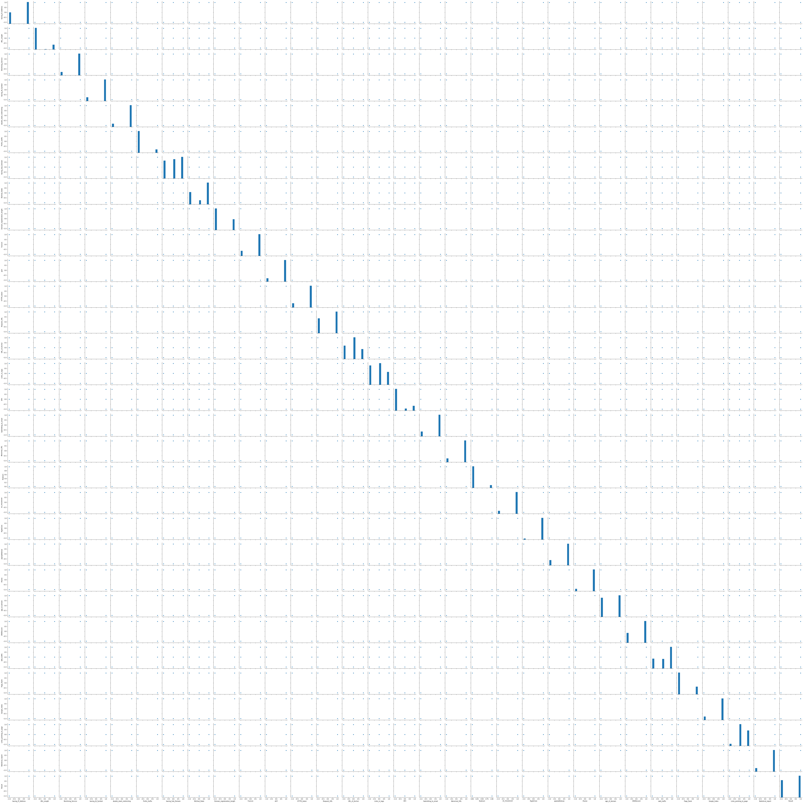

# Use Machine Learning and GridDB to Detect Phishing Websites 

   Curiosity alone can lead to getting your personal information leaked to anyone out there willing to have it. Are you the type that just clicks on any link a friend sends to you? It's dangerous! Hackers have so many ways of gathering information - they can gain your trust by social engineering and make you to do the things you would not do if it were just asked by a normal friend, and one of them is making you click on links.

   Phishing is a great technique used by hackers to gather information - passwords, emails, name, et cetera. When the process is successful, it gets your device vulnerable to exploits from hackers and they hack you (what they call pwning). Phishing comes with a lot of high chances because less work is done to gain the information.
    
   How is this done? One of the various ways the Facebook account could be hacked is by phishing and this has made a lot of users to lose their Facebook accounts due to that. The hacker clones the page where Facebook asks you to change your password or the page that asks you to login to Facebook. Then, he sets the backend to store anything you insert, into a database they can access. When you change your password, you're typing your old password as well as the new password. However, you're giving the hacker your password and he really appreciates that. After some time gaining your trust, probably on WhatsApp, he uses a tool to make the link have the format of a normal Facebook link and sends it to you - the test case (with an intriguing caption). You click on the link, fill in your details and he gains access to them that way. The next time you login to Facebook, you would notice that you can't access your account anymore. That's how phishing works! 
   
   Now, it is very imperative to have a method of detecting phishing websites. However, one might be safe by just being able to recognize phishing links. Below are flaws you could find in links to classify as being fake or not:
   * The link is shortened
   * The link is mispelt
   * The link doesn't have real characters - making use of Cyrillic letters
   * You have probably not heard of the website before or it ranks low
   * It is very long, having a combination of legit and unoriginal links

Hitherto, if you get to the website, there are also some tips that would help you detect a phishing website.
   * You would notice that the right-click button of your mouse has been disabled on the website. Now, hackers are really wise and very careful at what they do. Disabling the right-click button of your mouse prevents you from viewing page source (the source code of the page) because this would make you see what they don't want you to see. Though, you may not understand the code especially if you're not a programmer but you can still read English, and that matters a lot to them.
   * Getting regular pop-up windows can also be a way to detect a phishing website. A pop-up window, as the name implies, is just a mini window that pops up from the top of the page. When you get regular pop-ups, this should be a time to be suspicious about the website.

##### * This blog would guide you through how to build your own model to detect a phishing website.
* Here are the required tools for this tutorial:
    I am on a CentOS computer and I would assume the same for you.
    * Python 3.8 or Python 3.9.
      Get the latest version of Python from [the website](https://www.python.org/downloads)
    * A text editor like Notepad, Notepad++, Vim, Sublime, et cetera.
      Notepad comes preinstalled on every PC but you will have to download all other text editors
    * Jupyter Notebook (optional, if you already have the IDLE for Python).
      This is an environment used to write Python codes and it provides suitable cells where you can write code or text.
      You can get the Notebook by downloading Anaconda3 from https://www.anaconda.org, this would install some packages on your PC, including Jupyter Notebook and Spyder.

#### Now, let's get to the real business

The dataset we will be using for our model is the one provided by the University of California Irvine (UCI) website at [the official dataset website](https://archive.ics.uci.edu/ml/datasets/phishing+websites). This contains many numeric features that would help us classify websites as being legit or fake (real website or phishing website). The dataset has 2456 instances and 30 attributes as given by the website. It's always a good practice to check for missing values whenever we want to analyse data, but the website says there are no missing values. On the top of the page, you would see a Download label and two buttons; click on the first button which says **Data Folder**. It would redirect you to the page you can download the dataset (as an ARFF file). Click on the **Training Dataset.arff** file to download it. 

   However, you could decide to just visit [the UCI dataset page for it](https://archive.ics.uci.edu/ml/machine-learning-databases/00327/Training%20Dataset.arff) to download the dataset directly.
   
   To understand all the features, download the Phishing Website Features.docx file from [here](https://archive.ics.uci.edu/ml/machine-learning-databases/00327/Phishing%20Websites%20Features.docx). 

### Converting ARFF file to CSV

Since the dataset downloaded from the UCI website is an ARFF file, there's a need to convert it into a CSV file so we can use it in our Python code. Make sure the arff dataset file you downloaded is in the same folder as the one containing your Python code.


```python
import glob as gb # This builtin module would allow us to select only the file with .arff extension

files = [f for f in gb.glob("*.arff")] # We are using "files" because this selects all the files with that extension

# This function would convert the ARFF file to CSV file
def convert(lines):
    header = ""
    file_content = []
    data = not True
    
    for line in lines:
        if not data:
            if "@attribute" in line:
                attributes = line.split()
                columnName = attributes[attributes.index("@attribute")+1]
                header = header + columnName + ","
            elif "@data" in line:
                data = True
                header = header[:-1]
                header += "\n"
                file_content.append(header)
        else:
            file_content.append(line)
    return file_content
        

for file in files:
    with open(file, "r") as inp:
        lines = inp.readlines()
        output = convert(lines)
        with open("dataset" + ".csv", "w") as out:
            out.writelines(output)

```

## Using GridDB Python Client

Visit https://griddb.net/en/downloads/ to download GridDB Server and follow the installation instructions at the website to
install it. 
Note that you can't install Python's GridDB Client without having SWIG and the C_Client installed. Visit [here](http://prdownloads.sourceforge.net/swig/swigwin-4.0.2.zip) to download the version if you are on Windows or [here](http://prdownloads.sourceforge.net/swig/swig-4.0.2.tar.gz) to download the version for the available operating systems like CentOS and
Ubuntu.

Before you can use the Python Client, you have to run the server in advance and you should get the host, port, cluster name 
and user name noted down because you would use them in your Python Client code.

If you're using Jupyter notebook, you may need to follow the instructions [here](https://griddb.net/en/blog/using-python-to-interface-with-griddb-via-jdbc-with-jaydebeapi/) to get GridDB running on your notebook.

We would use GridDB as a container for our data, fill in the details of your GridDB server where you have empty quotes.


```python
import griddb_python as griddb
factory = griddb.StoreFactory.get_instance()
your_host = ""
your_port = ""
your_cluster_name = ""
your_username = ""
your_password = ""
try:
    gridstore = factory.get_store(host=your_host, port=your_port, 
            cluster_name=your_cluster_name, username=your_username, 
            password=your_password)
conInfo = griddb.ContainerInfo("Phishing Websites",
                    [              
                     ["having_IP_Address", griddb.Type.INTEGER],
                     ["URL_Length", griddb.Type.INTEGER],
                     ["Shortining_Service", griddb.Type.INTEGER],
                     ["having_At_Symbol", griddb.Type.INTEGER],
                     ["double_slash_redirecting", griddb.Type.INTEGER],
                     ["Prefix_Suffix", griddb.Type.INTEGER],
                     ["having_Sub_Domain", griddb.Type.INTEGER],
                     ["SSLfinal_State", griddb.Type.INTEGER],
                     ["Domain_registeration_length", griddb.Type.INTEGER],
                     ["Favicon", griddb.Type.INTEGER],
                     ["port", griddb.Type.INTEGER],
                     ["HTTPS_token", griddb.Type.INTEGER],
                     ["Request_URL", griddb.Type.INTEGER],
                     ["URL_of_Anchor", griddb.Type.INTEGER],
                     ["Links_in_tags", griddb.Type.INTEGER],
                     ["SFH", griddb.Type.INTEGER],
                     ["Submitting_to_email", griddb.Type.INTEGER],
                     ["Abnormal_URL", griddb.Type.INTEGER],
                     ["Redirect", griddb.Type.INTEGER],
                     ["on_mouseover", griddb.Type.INTEGER],
                     ["RightClick", griddb.Type.INTEGER],
                     ["popUpWidnow", griddb.Type.INTEGER],
                     ["Iframe", griddb.Type.INTEGER],
                     ["age_of_domain", griddb.Type.INTEGER],
                     ["DNSRecord", griddb.Type.INTEGER],
                     ["web_traffic", griddb.Type.INTEGER],
                     ["Page_Rank", griddb.Type.INTEGER],
                     ["Google_Index", griddb.Type.INTEGER],
                     ["Links_pointing_to_page", griddb.Type.INTEGER],
                     ["Statistical_report", griddb.Type.INTEGER],
                     ["Result", griddb.Type.INTEGER],                    
                    ],
                    griddb.ContainerType.COLLECTION, True)
    cont = gridstore.put_container(conInfo)   
    data = pd.read_csv("dataset.csv")
    
    #Add data
    for i in range(len(data)):
        ret = cont.put(data.iloc[i, :])
    print("Successfully added the data")
except griddb.GSException as e:
    for i in range(e.get_error_stack_size()):
        print("[", i, "]")
        print(e.get_error_code(i))
        print(e.get_location(i))
        print(e.get_message(i))
```


```python
import pandas as pd
dataset = pd.read_csv("dataset.csv")
```

### Printing the head of the dataset (showing the top five records of the data)

A good thing to understand about the dataset is that all the features are numeric (in numbers), so there would be no need to encode the data.
Also, the dataset has only three values - **1**, **-1** and **0**; these are just the forms of representing booleans of the data.
If the value is **1**, then the condition (attribute/column name) is true for that feature; if the value is **0** or **-1**, it is false.
Here is an instance, if there is a value of **1** under the **popUpWindow** column, it means that there was a popUpWindow. All these values determine what the result would be, the **Result** column also has **1** and **-1** values which represent **Phishing Website** and 
**Not a Phishing Website** respectively.

Use **print(dataset.head())** if you are using the Python IDLE


```python
""" You can also decide to show the bottom five records of the data by 
typing dataset.tail()"""
dataset.head()
```


<div>
<style scoped>
    .dataframe tbody tr th:only-of-type {
        vertical-align: middle;
    }

    .dataframe tbody tr th {
        vertical-align: top;
    }

    .dataframe thead th {
        text-align: right;
    }
</style>
<table border="1" class="dataframe">
  <thead>
    <tr style="text-align: right;">
      <th></th>
      <th>having_IP_Address</th>
      <th>URL_Length</th>
      <th>Shortining_Service</th>
      <th>having_At_Symbol</th>
      <th>double_slash_redirecting</th>
      <th>Prefix_Suffix</th>
      <th>having_Sub_Domain</th>
      <th>SSLfinal_State</th>
      <th>Domain_registeration_length</th>
      <th>Favicon</th>
      <th>...</th>
      <th>popUpWidnow</th>
      <th>Iframe</th>
      <th>age_of_domain</th>
      <th>DNSRecord</th>
      <th>web_traffic</th>
      <th>Page_Rank</th>
      <th>Google_Index</th>
      <th>Links_pointing_to_page</th>
      <th>Statistical_report</th>
      <th>Result</th>
    </tr>
  </thead>
  <tbody>
    <tr>
      <th>0</th>
      <td>-1</td>
      <td>1</td>
      <td>1</td>
      <td>1</td>
      <td>-1</td>
      <td>-1</td>
      <td>-1</td>
      <td>-1</td>
      <td>-1</td>
      <td>1</td>
      <td>...</td>
      <td>1</td>
      <td>1</td>
      <td>-1</td>
      <td>-1</td>
      <td>-1</td>
      <td>-1</td>
      <td>1</td>
      <td>1</td>
      <td>-1</td>
      <td>-1</td>
    </tr>
    <tr>
      <th>1</th>
      <td>1</td>
      <td>1</td>
      <td>1</td>
      <td>1</td>
      <td>1</td>
      <td>-1</td>
      <td>0</td>
      <td>1</td>
      <td>-1</td>
      <td>1</td>
      <td>...</td>
      <td>1</td>
      <td>1</td>
      <td>-1</td>
      <td>-1</td>
      <td>0</td>
      <td>-1</td>
      <td>1</td>
      <td>1</td>
      <td>1</td>
      <td>-1</td>
    </tr>
    <tr>
      <th>2</th>
      <td>1</td>
      <td>0</td>
      <td>1</td>
      <td>1</td>
      <td>1</td>
      <td>-1</td>
      <td>-1</td>
      <td>-1</td>
      <td>-1</td>
      <td>1</td>
      <td>...</td>
      <td>1</td>
      <td>1</td>
      <td>1</td>
      <td>-1</td>
      <td>1</td>
      <td>-1</td>
      <td>1</td>
      <td>0</td>
      <td>-1</td>
      <td>-1</td>
    </tr>
    <tr>
      <th>3</th>
      <td>1</td>
      <td>0</td>
      <td>1</td>
      <td>1</td>
      <td>1</td>
      <td>-1</td>
      <td>-1</td>
      <td>-1</td>
      <td>1</td>
      <td>1</td>
      <td>...</td>
      <td>1</td>
      <td>1</td>
      <td>-1</td>
      <td>-1</td>
      <td>1</td>
      <td>-1</td>
      <td>1</td>
      <td>-1</td>
      <td>1</td>
      <td>-1</td>
    </tr>
    <tr>
      <th>4</th>
      <td>1</td>
      <td>0</td>
      <td>-1</td>
      <td>1</td>
      <td>1</td>
      <td>-1</td>
      <td>1</td>
      <td>1</td>
      <td>-1</td>
      <td>1</td>
      <td>...</td>
      <td>-1</td>
      <td>1</td>
      <td>-1</td>
      <td>-1</td>
      <td>0</td>
      <td>-1</td>
      <td>1</td>
      <td>1</td>
      <td>1</td>
      <td>1</td>
    </tr>
  </tbody>
</table>
<p>5 rows × 31 columns</p>
</div>


```python
dataset.shape # Number of rows and columns
```


    (11055, 31)


```python
dataset.describe() # Describing the data to gain insights from it
```


<div>
<style scoped>
    .dataframe tbody tr th:only-of-type {
        vertical-align: middle;
    }

    .dataframe tbody tr th {
        vertical-align: top;
    }

    .dataframe thead th {
        text-align: right;
    }
</style>
<table border="1" class="dataframe">
  <thead>
    <tr style="text-align: right;">
      <th></th>
      <th>having_IP_Address</th>
      <th>URL_Length</th>
      <th>Shortining_Service</th>
      <th>having_At_Symbol</th>
      <th>double_slash_redirecting</th>
      <th>Prefix_Suffix</th>
      <th>having_Sub_Domain</th>
      <th>SSLfinal_State</th>
      <th>Domain_registeration_length</th>
      <th>Favicon</th>
      <th>...</th>
      <th>popUpWidnow</th>
      <th>Iframe</th>
      <th>age_of_domain</th>
      <th>DNSRecord</th>
      <th>web_traffic</th>
      <th>Page_Rank</th>
      <th>Google_Index</th>
      <th>Links_pointing_to_page</th>
      <th>Statistical_report</th>
      <th>Result</th>
    </tr>
  </thead>
  <tbody>
    <tr>
      <th>count</th>
      <td>11055.000000</td>
      <td>11055.000000</td>
      <td>11055.000000</td>
      <td>11055.000000</td>
      <td>11055.000000</td>
      <td>11055.000000</td>
      <td>11055.000000</td>
      <td>11055.000000</td>
      <td>11055.000000</td>
      <td>11055.000000</td>
      <td>...</td>
      <td>11055.000000</td>
      <td>11055.000000</td>
      <td>11055.000000</td>
      <td>11055.000000</td>
      <td>11055.000000</td>
      <td>11055.000000</td>
      <td>11055.000000</td>
      <td>11055.000000</td>
      <td>11055.000000</td>
      <td>11055.000000</td>
    </tr>
    <tr>
      <th>mean</th>
      <td>0.313795</td>
      <td>-0.633198</td>
      <td>0.738761</td>
      <td>0.700588</td>
      <td>0.741474</td>
      <td>-0.734962</td>
      <td>0.063953</td>
      <td>0.250927</td>
      <td>-0.336771</td>
      <td>0.628584</td>
      <td>...</td>
      <td>0.613388</td>
      <td>0.816915</td>
      <td>0.061239</td>
      <td>0.377114</td>
      <td>0.287291</td>
      <td>-0.483673</td>
      <td>0.721574</td>
      <td>0.344007</td>
      <td>0.719584</td>
      <td>0.113885</td>
    </tr>
    <tr>
      <th>std</th>
      <td>0.949534</td>
      <td>0.766095</td>
      <td>0.673998</td>
      <td>0.713598</td>
      <td>0.671011</td>
      <td>0.678139</td>
      <td>0.817518</td>
      <td>0.911892</td>
      <td>0.941629</td>
      <td>0.777777</td>
      <td>...</td>
      <td>0.789818</td>
      <td>0.576784</td>
      <td>0.998168</td>
      <td>0.926209</td>
      <td>0.827733</td>
      <td>0.875289</td>
      <td>0.692369</td>
      <td>0.569944</td>
      <td>0.694437</td>
      <td>0.993539</td>
    </tr>
    <tr>
      <th>min</th>
      <td>-1.000000</td>
      <td>-1.000000</td>
      <td>-1.000000</td>
      <td>-1.000000</td>
      <td>-1.000000</td>
      <td>-1.000000</td>
      <td>-1.000000</td>
      <td>-1.000000</td>
      <td>-1.000000</td>
      <td>-1.000000</td>
      <td>...</td>
      <td>-1.000000</td>
      <td>-1.000000</td>
      <td>-1.000000</td>
      <td>-1.000000</td>
      <td>-1.000000</td>
      <td>-1.000000</td>
      <td>-1.000000</td>
      <td>-1.000000</td>
      <td>-1.000000</td>
      <td>-1.000000</td>
    </tr>
    <tr>
      <th>25%</th>
      <td>-1.000000</td>
      <td>-1.000000</td>
      <td>1.000000</td>
      <td>1.000000</td>
      <td>1.000000</td>
      <td>-1.000000</td>
      <td>-1.000000</td>
      <td>-1.000000</td>
      <td>-1.000000</td>
      <td>1.000000</td>
      <td>...</td>
      <td>1.000000</td>
      <td>1.000000</td>
      <td>-1.000000</td>
      <td>-1.000000</td>
      <td>0.000000</td>
      <td>-1.000000</td>
      <td>1.000000</td>
      <td>0.000000</td>
      <td>1.000000</td>
      <td>-1.000000</td>
    </tr>
    <tr>
      <th>50%</th>
      <td>1.000000</td>
      <td>-1.000000</td>
      <td>1.000000</td>
      <td>1.000000</td>
      <td>1.000000</td>
      <td>-1.000000</td>
      <td>0.000000</td>
      <td>1.000000</td>
      <td>-1.000000</td>
      <td>1.000000</td>
      <td>...</td>
      <td>1.000000</td>
      <td>1.000000</td>
      <td>1.000000</td>
      <td>1.000000</td>
      <td>1.000000</td>
      <td>-1.000000</td>
      <td>1.000000</td>
      <td>0.000000</td>
      <td>1.000000</td>
      <td>1.000000</td>
    </tr>
    <tr>
      <th>75%</th>
      <td>1.000000</td>
      <td>-1.000000</td>
      <td>1.000000</td>
      <td>1.000000</td>
      <td>1.000000</td>
      <td>-1.000000</td>
      <td>1.000000</td>
      <td>1.000000</td>
      <td>1.000000</td>
      <td>1.000000</td>
      <td>...</td>
      <td>1.000000</td>
      <td>1.000000</td>
      <td>1.000000</td>
      <td>1.000000</td>
      <td>1.000000</td>
      <td>1.000000</td>
      <td>1.000000</td>
      <td>1.000000</td>
      <td>1.000000</td>
      <td>1.000000</td>
    </tr>
    <tr>
      <th>max</th>
      <td>1.000000</td>
      <td>1.000000</td>
      <td>1.000000</td>
      <td>1.000000</td>
      <td>1.000000</td>
      <td>1.000000</td>
      <td>1.000000</td>
      <td>1.000000</td>
      <td>1.000000</td>
      <td>1.000000</td>
      <td>...</td>
      <td>1.000000</td>
      <td>1.000000</td>
      <td>1.000000</td>
      <td>1.000000</td>
      <td>1.000000</td>
      <td>1.000000</td>
      <td>1.000000</td>
      <td>1.000000</td>
      <td>1.000000</td>
      <td>1.000000</td>
    </tr>
  </tbody>
</table>
<p>8 rows × 31 columns</p>
</div>


## Building our Model to Predict the Results 

This stage is where we build a model to predict if a website is a phishing website or not
We would use a Decision Trees Classifier.

### Building a Decision Tree Classifier model

The dataset has many columns but only the last column represents the result of the predictions if the values in all other columns are
true. In other words, the last column depends on all other columns from the first to the penultimate column and it is
called the **Dependent Feature**. All the other columns are called **Independent Features**.
We are going to define two variables, **X** and **y** to store the values of the independent and dependent features respectively. So, **X** is referred to as the **Independent Variable** while **y** is the **Dependent Variable**.

The syntax for selecting the values is **data.iloc[number_of_rows_to_select, number_of_columns_to_select].values**. Since we are selecting all the rows, we would slice the dataset values from the first row to the last row using the slice operator **:** in Python; but
for X, we only need all the columns except the last column (result) so we are going to slice, leaving out the last column. For y, we need the just the last column therefore no need for slicing.  


```python
X = dataset.iloc[:, :-1].values
y = dataset.iloc[:, -1].values
```


```python
print(X)
```

    [[-1  1  1 ...  1  1 -1]
     [ 1  1  1 ...  1  1  1]
     [ 1  0  1 ...  1  0 -1]
     ...
     [ 1 -1  1 ...  1  0  1]
     [-1 -1  1 ...  1  1  1]
     [-1 -1  1 ... -1  1 -1]]
    


```python
print(y)
```

    [-1 -1 -1 ... -1 -1 -1]
    

### Splitting the dataset into Training Set and Test Set


```python
from sklearn.model_selection import train_test_split as tts
```


```python
X_train, X_test, y_train, y_test = tts(X, y, test_size=0.30, random_state=0)
```

We are training 70% of the data to predict the remaining 30% whether they are phishing websites or not. Thus, we are training
approximately 1719 websites to predict approximately 739 websites, using Machine Learning.

## Visualizing Data

GridDB also provides powerful Data Visualization, follow the instructions [here](https://griddb.net/en/blog/data-visualization-with-python-matplotlib-and-griddb/) to visualize the data using GridDB and Python's matplotlib. Seaborn is used here and this takes
a great deal of time to visualize because of the numerous attributes of the dataset.


```python
import seaborn as sns
sns.pairplot(dataset)
```


    <seaborn.axisgrid.PairGrid at 0xeced8d0>





From the visualization above, we can observe that the **age_of_domain** column correlates with the **Result** column.

### Building the model to classify whether a link is from a phishing website or not


```python
from sklearn.tree import DecisionTreeClassifier
```


```python
dtClassifier = DecisionTreeClassifier()
```


```python
dtClassifier.fit(X_train, y_train)
```


    DecisionTreeClassifier(class_weight=None, criterion='gini', max_depth=None,
                           max_features=None, max_leaf_nodes=None,
                           min_impurity_decrease=0.0, min_impurity_split=None,
                           min_samples_leaf=1, min_samples_split=2,
                           min_weight_fraction_leaf=0.0, presort=False,
                           random_state=None, splitter='best')


```python
dty_pred = dtClassifier.predict(X_test)
```


```python
print(dty_pred)
```

    [-1 -1 -1 ... -1  1  1]
    


```python
from sklearn.metrics import confusion_matrix
cMatrix = confusion_matrix(y_test, dty_pred)
print(cMatrix)
```

    [[1426   72]
     [  48 1771]]
    


```python
# Accuracy of the model
dtacc = dtClassifier.score(X_test, y_test)
dtacc *= 100
dtaccu = round(dtacc, 2)
dtaccuracy = str(dtaccu)+"%"
print(
f"""
The Accuracy of our model, using the Decision Tree Classifier
{dtaccuracy}
"""
)
```

    
    The Accuracy of our model, using the Decision Tree Classifier
    96.38%
    
    

A good use for this model is where you have a website url and fill in all the features of the website according to the dataset, except the last one; you could then use the model to predict if it is a phishing website or not.
Now, it is a very good practice to use GridDB for Machine Learning. It allows us to store the dataset in a container and also has the capability of storing Machine Learning models. So, in case you want to use your model in a project, GridDB would be a good choice since you could also access the model you stored. More information about GridDB is available at https://www.griddb.net/.
